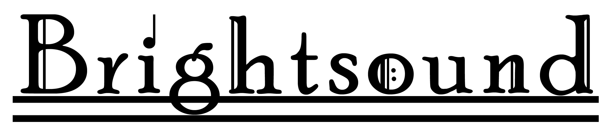

Brightsound is a 2D puzzle platformer in which the player manipulates light and sound to traverse the environment.
This game was made over the course of a weekend for the annual Global Game Jam Event. All art, sound, and music is original and was made on site at GGJ.

## Getting Started

The quickest and easiest way to play this game is to go to the following link and download our provided executable.
http://globalgamejam.org/2017/games/brightsound

Otherwise you will need to open our game Unity 5.5.0f3 and build it manually from there. Game currently supports builds for both Macs and PCs.

## Controls
WASD - Movement

Space - Jump

Left Click - Light Wave

Right Click - Sound Wave 

Light Wave activates switches, damages enemies, and allows double jumps. Sound Wave provides a speed boost on entry.

## Built With
Unity 5.5.0f3

## Contributing
We are currently not looking for any contributions to this game so most contribution requests will most likely be denied. However, we are willing to consider all contributions on a case by case basis and will accept depending on the quality of the contribution.

## Authors
* [**Efren Aguilar**](https://github.com/efrenaguilar95) - Sound, Music, Programming
* [**Edwin Ho**](https://edwinho555.itch.io/) - Programming
* [**Dashiell Powers**](https://github.com/DashiellP) - Design, Programming
* [**Peter Truong**](https://pgtruong.github.io/) - Programming
* [**Monami Yang**](https://github.com/ichigolollipop) - Art

## License

This project is licensed under all legal policies instituted by the GGJ. Click [here](http://globalgamejam.org/code-conduct-legal-policies) or details
